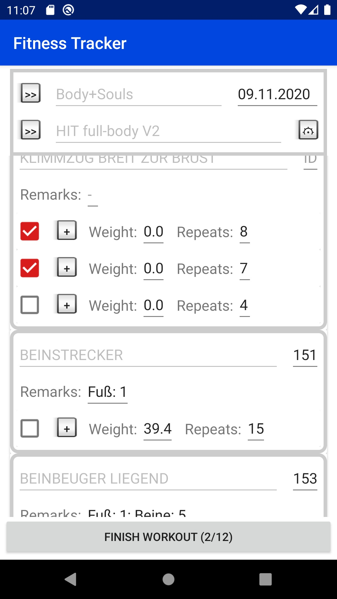
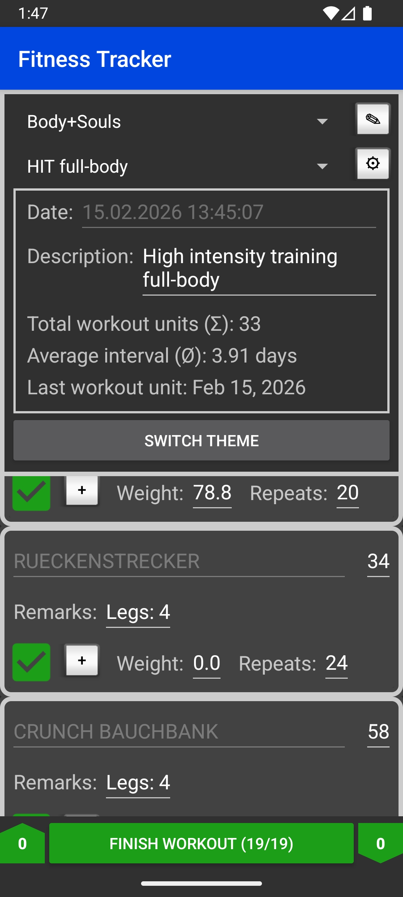
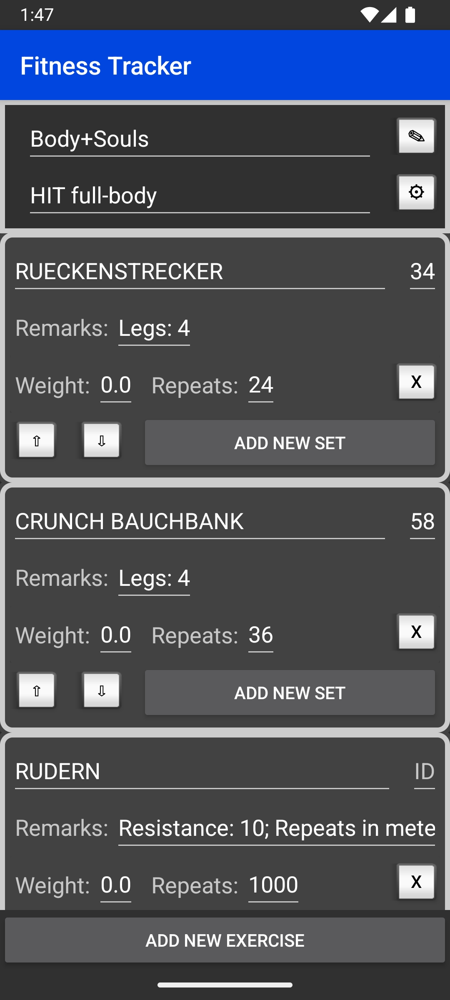
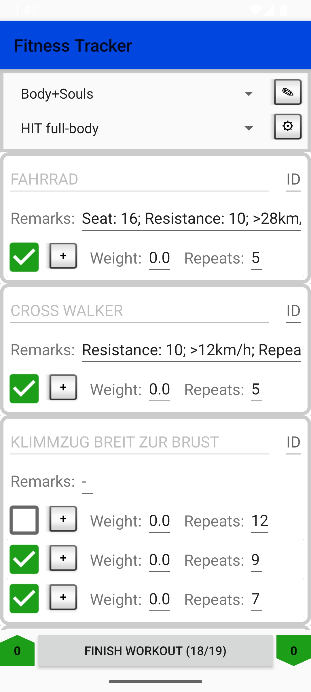

# Fitness Tracker

Compact single screen fitness tracker app for Android smartphones. All exercises for a workout are displayed in one scrollable list on a single screen, where every exercise set can be completed with one button press. Supports multiple studios and workout routines, switchable via dropdown spinners.

More in-depth data, settings and edit options can be accessed via an expandable top box menu.

<table>
  <tr>
    <td>Regular view</td>
    <td>Expanded top box</td>
    <td>Edit mode</td>
    <td>Light mode</td>
  </tr>
  <tr>
    <td></td>
    <td></td>
    <td></td>
    <td></td>
  </tr>
</table>

## Features

- **Single-screen workout tracking** — all exercises visible in one scrollable list
- **One-tap set completion** — checkbox + auto-increment button for reps/weight progression
- **Done exercise collapsing** — finished exercises automatically collapse to show only their name row highlighted in green; tap the name to expand/collapse manually; edit mode disables this behavior
- **Unfinished exercise indicators** — arrow buttons left/right of finish button show count of incomplete exercises above/below viewport; click to scroll to the first/last unfinished exercise; turn green when none remain in that direction
- **Unfinished exercise previews** — collapsed exercise card shown above/below the board when an unfinished exercise is outside the visible area; tap to scroll to it
- **Studio & workout switching** — dropdown spinners to change between studios and workout routines
- **Automatic workout cloning** — finishing a workout creates a new session pre-filled with the previous structure
- **Edit mode** — toggle to rename exercises, reorder them, add/remove sets, and edit studio/workout names
- **Exercise management** — add new or existing exercises via dropdown menu; long-press (5 seconds) on existing exercises to remove them from all workouts
- **Workout statistics** — total workout count, average interval between sessions, last workout date
- **Light/dark theme support** — three-way toggle (system/light/dark) with persistent preference

## Architecture

Single-activity MVVM architecture using Android Architecture Components.

```
MainActivity → MainViewModel → DataRepository → AppDatabase (Room)
```

| Layer | Package | Key Classes |
|-------|---------|-------------|
| UI | `ui/` | `MainActivity`, `ExerciseInfoAdapter`, `ExerciseSetAdapter`, `BindingAdapters` |
| ViewModels | `viewmodels/` | `MainViewModel` |
| Repository | root | `DataRepository` (singleton, executor-based async) |
| Database | `database/` | `AppDatabase`, `WorkoutUnitEntity/Dao`, `ExerciseSetEntity/Dao`, `ExerciseInfoEntity/Dao`, `DateConverter` |
| Models | `model/` | `WorkoutUnit`, `ExerciseSet`, `ExerciseInfo` (interfaces) |
| Application | root | `BasicApp` (dependency injection root) |

### Data Model

- **WorkoutUnitEntity** — a workout session (primary key: `Date`), stores studio, name, description, and exercise order as a delimited string (`EXERCISE_NAMES_SEPARATOR = ","` separates name and set count per entry, `EXERCISE_NAMES_DELIMITER = ";"` separates entries)
- **ExerciseSetEntity** — a single set within a workout (auto-generated ID), linked via foreign keys to `WorkoutUnitEntity` (CASCADE) and `ExerciseInfoEntity` (RESTRICT); template sets (with `workoutUnitDate = NULL`) store default values for quick exercise re-addition
- **ExerciseInfoEntity** — exercise metadata (primary key: `name`), stores token and remarks

### Key Patterns

- All layouts use Android Data Binding with `<layout>` root tags
- Card-based UI: `exercise_card.xml` and `exercise_set_card.xml`
- Repository uses callback-based async with `CallbackAction<T>` / `CallbackCondition<T>` and `executeOnceForLiveData()` utility, backed by a single-thread executor
- Room database version 6 with full migration chain from version 1; schema files exported to `app/schemas/` — check the latest version there before entity changes and add migration logic when modifying entities
- Entities implement model interfaces; copy constructors enable workout cloning
- When switching or finishing workouts, database operations must complete before updating observable LiveData (`postValue` inside the executor) to prevent the UI from loading stale data — see `replaceCurrentWorkoutUnit` and `finishWorkout` in `DataRepository`
- Edits to studio or workout names immediately store the current workout unit (`storeCurrentWorkoutUnit`), making new studios/workouts switchable before finishing
- Java classes are organized with "Data code" (constants) and "Functional code" (fields, constructors, methods) section markers

## Build & Development

| Setting | Value |
|---------|-------|
| Compile SDK | 36 |
| Target SDK | 36 |
| Min SDK | 28 |
| Java | 11 (source/target compatibility) |
| Room | 2.3.0 |
| Lifecycle | 2.3.1 |

### Commands

```bash
# Build debug APK
./gradlew assembleDebug

# Run unit tests
./gradlew test

# Run instrumented tests
./gradlew connectedAndroidTest
```

### Debug Configuration

- `MainActivity.DEBUG_MODE_ACTIVE = true` enables debug logging and debug-only UI elements
- Debug builds set `buildConfigField "boolean", "ENABLE_ASSERTIONS", "true"`
- Room schema export is configured via `room.schemaLocation = "$projectDir/schemas"`

### Project Structure

```
app/
├── schemas/                       # Room schema exports (versions 1–6)
app/src/main/
├── java/.../fitnesstracker/
│   ├── BasicApp.java              # Application class
│   ├── AppExecutors.java          # Thread pool helper
│   ├── DataRepository.java        # Centralized data access (singleton)
│   ├── database/
│   │   ├── AppDatabase.java       # Room database + migrations
│   │   ├── DateConverter.java     # Room type converter
│   │   ├── WorkoutUnitEntity.java # Workout session entity
│   │   ├── WorkoutUnitDao.java    # Workout DAO
│   │   ├── ExerciseSetEntity.java # Exercise set entity
│   │   ├── ExerciseSetDao.java    # Exercise set DAO
│   │   ├── ExerciseInfoEntity.java# Exercise metadata entity
│   │   └── ExerciseInfoDao.java   # Exercise metadata DAO
│   ├── model/
│   │   ├── WorkoutUnit.java       # Interface
│   │   ├── ExerciseSet.java       # Interface
│   │   └── ExerciseInfo.java      # Interface
│   ├── ui/
│   │   ├── MainActivity.java      # Single activity
│   │   ├── ExerciseInfoAdapter.java# RecyclerView adapter (exercises)
│   │   ├── ExerciseSetAdapter.java # Nested RecyclerView adapter (sets)
│   │   └── BindingAdapters.java   # Custom data binding adapters
│   └── viewmodels/
│       └── MainViewModel.java     # MVVM bridge
├── res/
│   ├── layout/
│   │   ├── workout_screen.xml     # Main screen layout
│   │   ├── exercise_card.xml      # Exercise card layout
│   │   └── exercise_set_card.xml  # Exercise set card layout
│   ├── drawable/                  # Borders, icons
│   └── values/                    # Colors, dimens, strings, styles
```

## License

See [LICENSE](LICENSE) for details.
