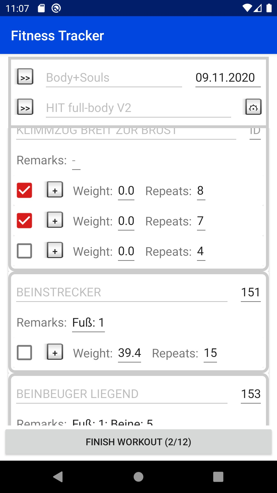
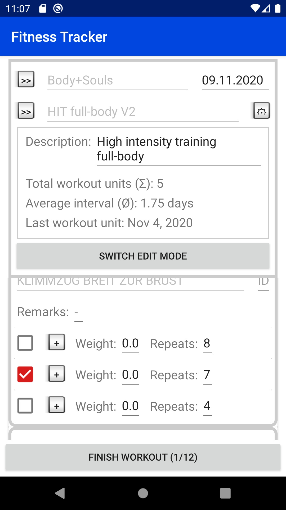

# Fitness Tracker
 
Compact fitness tracker app for smartphones. Every required data and inputs for a regular workout are conveniently placed on one screen. Therefore all exercises are listed in one scrollable list where every exercise set can be finished with one button press.

More in-depth data, settings and edit options can be accessed via an expandable top box menu.

<table>
  <tr>
    <td>Regular view</td>
    <td>Expanded top box</td>
  </tr>
  <tr>
    <td></td>
    <td></td>
  </tr>
</table>
